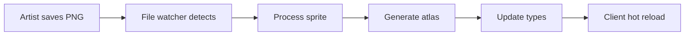

# Art Package

The **art asset pipeline** for the MUD game, featuring automated sprite processing, tileset management, and TypeScript type generation for seamless integration with the game client.

## 🎨 Overview

This package manages all visual assets for the game, including character sprites, world tilesets, and UI elements. It provides an automated pipeline that processes raw art assets and generates optimized game-ready files with full TypeScript support.

### Key Features

- **Automated Sprite Processing**: Convert sprite sheets to optimized atlases
- **TypeScript Integration**: Auto-generated type definitions
- **Tiled Map Support**: Integration with Tiled map editor
- **Hot Reload**: Asset changes reflect immediately in development
- **Optimized Output**: Web-optimized formats and compression

## 📁 Asset Structure

```
packages/art/
├── sprites/              # Character and entity sprites
│   ├── coin/
│   │   └── coin/         # Coin animation frames
│   └── golem/
│       ├── attack/       # Attack animation
│       ├── death/        # Death animation
│       └── idle/         # Idle animation
├── tilesets/            # World tiles and maps
│   ├── world.tsx        # Tiled tileset definition
│   └── images/
│       └── world.png    # Tileset image
├── scripts/             # Processing tools
│   ├── cli.mjs         # Command-line interface
│   └── export-tiled-types.ts
└── config-sprites.json  # Sprite configuration
```

## 🚀 Quick Start

### Processing Assets

```bash
# Process all sprites and generate types
pnpm build

# Watch mode for development
pnpm dev

# Clean generated files
pnpm clean
```

### Adding New Sprites

1. **Create sprite directory**: `sprites/new-entity/animation-name/`
2. **Add PNG frames**: Name them sequentially (001.png, 002.png, etc.)
3. **Update config**: Add to `config-sprites.json` if needed
4. **Process assets**: Run `pnpm build`
5. **Import in client**: Use generated TypeScript types

## 🔧 Configuration

### config-sprites.json

Defines sprite processing settings:

```json
{
  "sprites": {
    "golem": {
      "idle": {
        "frameRate": 8,
        "loop": true,
        "frames": 4
      },
      "attack": {
        "frameRate": 12,
        "loop": false,
        "frames": 6
      }
    }
  },
  "output": {
    "format": "atlas",
    "compression": "medium",
    "generateTypes": true
  }
}
```

### Processing Options

- **frameRate**: Animation speed (fps)
- **loop**: Whether animation repeats
- **frames**: Number of animation frames
- **compression**: Image optimization level
- **generateTypes**: Create TypeScript definitions

## 🖼️ Sprite Guidelines

### File Naming

```
sprites/
└── entity-name/
    └── animation-name/
        ├── 001.png
        ├── 002.png
        ├── 003.png
        └── ...
```

### Image Specifications

- **Format**: PNG with transparency
- **Size**: Consistent within animation
- **Naming**: Zero-padded numbers (001, 002, etc.)
- **Resolution**: Power of 2 dimensions recommended
- **Color**: RGB + Alpha channel

### Animation Best Practices

1. **Consistent Timing**: Keep frame rates suitable for game feel
2. **Smooth Loops**: Ensure first and last frames transition well
3. **Pivot Points**: Keep character anchors consistent across frames
4. **File Size**: Balance quality and performance

## 🗺️ Tileset Management

### Tiled Integration

The package supports **Tiled Map Editor** for world design:

```
tilesets/
├── world.tsx        # Tileset definition
└── images/
    └── world.png    # Source tileset image
```

### Tileset Structure

- **Grid-based**: Fixed tile dimensions (typically 32x32)
- **Indexed**: Each tile has unique ID
- **Properties**: Custom data per tile type
- **Collision**: Physics and interaction data

### Creating Tilesets

1. **Design tileset**: Create grid-based PNG image
2. **Import to Tiled**: Set up tileset properties
3. **Export types**: Run processing script
4. **Use in client**: Import generated definitions

## 🎭 Sprite Types Generation

The build process generates TypeScript types for type-safe asset loading:

```typescript
// Generated in ../client/src/artTypes/world.ts
export const Sprites = {
  Golem: {
    Idle: {
      assetKey: "golem-idle",
      imagePath: "/assets/atlases/golem-idle.png",
      jsonPath: "/assets/atlases/golem-idle.json",
      frameCount: 4,
      frameRate: 8,
    },
    Attack: {
      assetKey: "golem-attack",
      imagePath: "/assets/atlases/golem-attack.png",
      jsonPath: "/assets/atlases/golem-attack.json",
      frameCount: 6,
      frameRate: 12,
    },
  },
  Coin: {
    Coin: {
      assetKey: "coin-coin",
      imagePath: "/assets/atlases/coin-coin.png",
      jsonPath: "/assets/atlases/coin-coin.json",
      frameCount: 8,
      frameRate: 10,
    },
  },
} as const;
```

### Usage in Client

```typescript
// Type-safe sprite loading
import { Sprites } from "../artTypes/world";

// Phaser sprite loading
this.load.atlas(
  Sprites.Golem.Idle.assetKey,
  Sprites.Golem.Idle.imagePath,
  Sprites.Golem.Idle.jsonPath
);

// Create animated sprite
this.anims.create({
  key: "golem-idle",
  frames: this.anims.generateFrameNames(Sprites.Golem.Idle.assetKey),
  frameRate: Sprites.Golem.Idle.frameRate,
  repeat: -1,
});
```

## 🛠️ Development Tools

### CLI Interface

```bash
# Process specific sprite
node scripts/cli.mjs --sprite golem/idle

# Generate only TypeScript types
node scripts/cli.mjs --types-only

# Verbose output
node scripts/cli.mjs --verbose

# Clean and rebuild
node scripts/cli.mjs --clean --build
```

### Watch Mode

For development, enable file watching:

```bash
pnpm dev
```

This will:

- Monitor sprite directories for changes
- Automatically reprocess modified assets
- Update TypeScript types
- Notify client for hot reload

## 📦 Output Format

### Atlas Generation

Sprites are packed into efficient texture atlases:

```
public/assets/atlases/
├── golem-idle.png      # Packed texture
├── golem-idle.json     # Frame coordinates
├── golem-attack.png
├── golem-attack.json
├── coin-coin.png
└── coin-coin.json
```

### Atlas JSON Structure

```json
{
  "frames": {
    "golem-idle-001.png": {
      "frame": { "x": 0, "y": 0, "w": 64, "h": 64 },
      "rotated": false,
      "trimmed": false,
      "spriteSourceSize": { "x": 0, "y": 0, "w": 64, "h": 64 },
      "sourceSize": { "w": 64, "h": 64 }
    }
  },
  "animations": {
    "golem-idle": {
      "frames": ["golem-idle-001.png", "golem-idle-002.png"],
      "frameRate": 8
    }
  }
}
```

## 🎨 Art Creation Guidelines

### Style Consistency

- **Pixel Art**: 16x16 or 32x32 base resolution
- **Color Palette**: Limited, consistent colors
- **Lighting**: Single light source direction
- **Proportions**: Consistent character scaling

### Animation Principles

1. **Timing**: 8-12 fps for pixel art
2. **Anticipation**: Prepare viewers for action
3. **Squash and Stretch**: Add life to movements
4. **Follow Through**: Complete actions naturally

### Performance Considerations

- **Frame Count**: Balance smoothness with file size
- **Atlas Packing**: Efficient texture usage
- **Compression**: Optimize for web delivery
- **Resolution**: Match game's pixel density

## 🔄 Integration Workflow

### Asset to Game Pipeline

1. **Artist creates sprites** in preferred tool
2. **Export PNG frames** to appropriate directories
3. **Run build process** to generate atlases
4. **Types are generated** automatically
5. **Client imports types** for loading
6. **Phaser renders sprites** in game

### Hot Reload Process



## 🧪 Testing Assets

### Visual Testing

```bash
# Preview generated atlases
node scripts/cli.mjs --preview

# Check animation timing
node scripts/cli.mjs --test-animation golem/idle
```

### Validation

- **Frame consistency**: Verify all frames load correctly
- **Animation smoothness**: Test in game context
- **File sizes**: Monitor asset bundle size
- **Type safety**: Ensure TypeScript compilation

## 📊 Asset Optimization

### Compression Settings

```json
{
  "compression": {
    "png": {
      "quality": 90,
      "colors": 256,
      "dithering": false
    },
    "atlas": {
      "padding": 2,
      "powerOfTwo": true,
      "maxSize": 2048
    }
  }
}
```

### Performance Metrics

- **Atlas utilization**: Aim for >80% texture usage
- **Draw calls**: Minimize by efficient packing
- **Memory usage**: Balance quality and RAM
- **Load time**: Optimize for web delivery

## 🤝 Contributing

### Adding New Art Assets

1. **Follow naming conventions**: Use consistent directory structure
2. **Maintain quality**: Match existing art style
3. **Test thoroughly**: Verify in-game appearance
4. **Document changes**: Update this README if needed

### Improving Pipeline

1. **Optimize processing**: Reduce build times
2. **Add validation**: Catch errors early
3. **Enhance types**: Improve developer experience
4. **Monitor performance**: Track asset metrics

### Tools and Software

Recommended art creation tools:

- **Aseprite**: Pixel art and animation
- **Photoshop**: General image editing
- **Tiled**: Map and tileset creation
- **TexturePacker**: Manual atlas creation

---

**Creating beautiful, performant game art! 🎨⚡**
